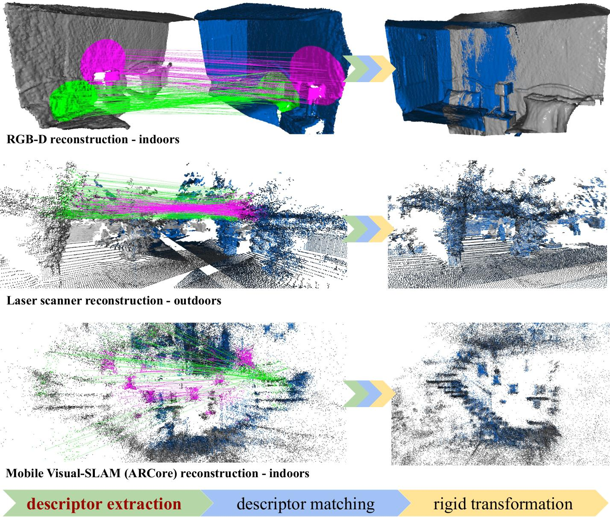
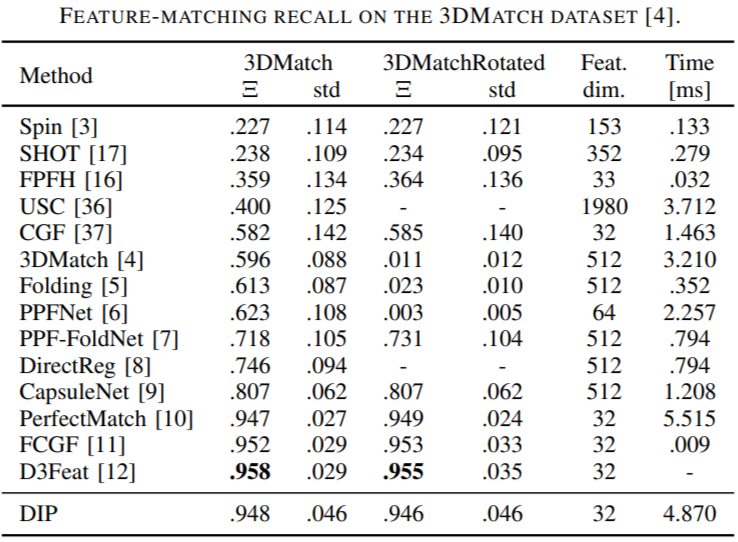
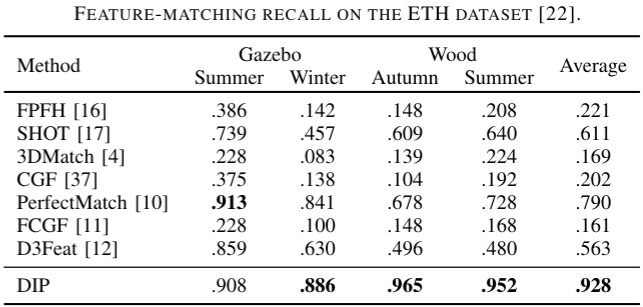
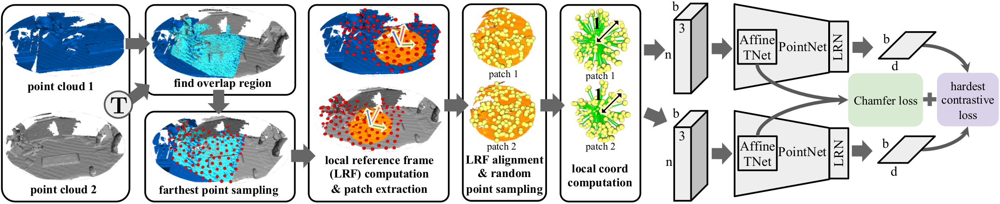
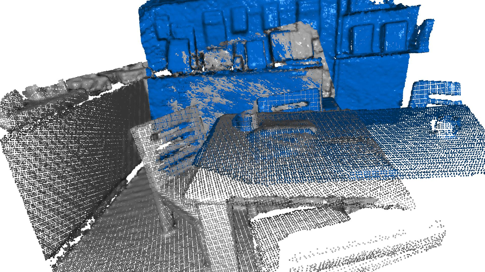
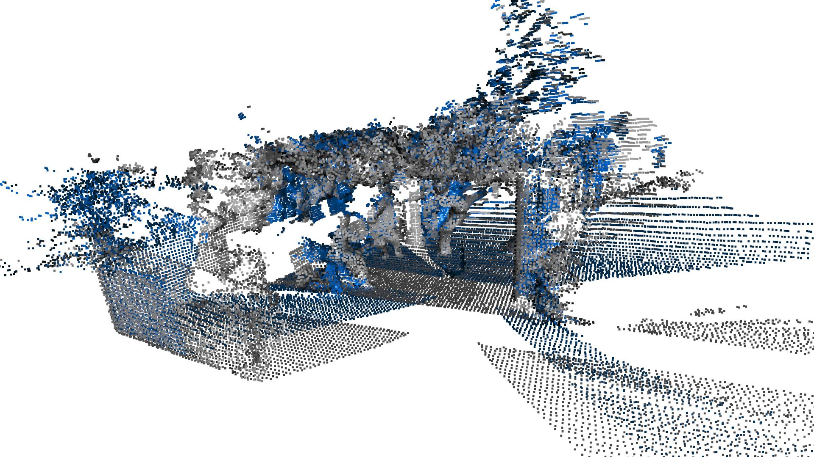
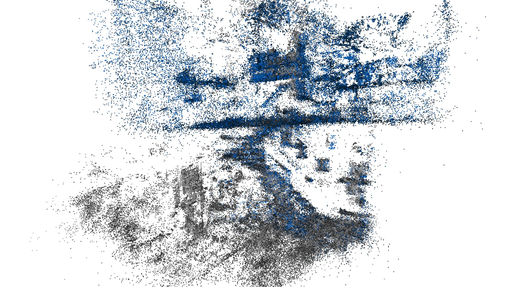

# Distinctive 3D local deep descriptors, ICPR 2020
Distinctive 3D local deep descriptors (DIPs) are rotation-invariant compact 3D descriptors computed using a PointNet-based deep neural network.
DIPs can be used to register point clouds without requiring an initial alignment.
DIPs are generated from point-cloud patches that are canonicalised with respect to their estimated local reference frame (LRF).
**DIPs can effectively generalise across different sensor modalities** because they are learnt end-to-end from locally and randomly sampled points. 
DIPs 
(i) achieve comparable results to the state-of-the-art on RGB-D indoor scenes ([3DMatch dataset](http://3dmatch.cs.princeton.edu/)), 
(ii) outperform state-of-the-art by a large margin in terms of generalisation on laser-scanner outdoor scenes ([ETH dataset](https://projects.asl.ethz.ch/datasets/doku.php?id=laserregistration:laserregistration)), and 
(iii) generalise to indoor scenes reconstructed with the Visual-SLAM system of Android ARCore.

[Paper (pdf)](https://arxiv.org/pdf/2009.00258.pdf)

<p align="center"></p>

## Descriptor quality and generalisation ability

Descriptor quality is assessed using feature-matching recall [6]. See the paper for the references.

| 3DMatch dataset           | Generalisation ability on ETH dataset           |
|:---------------------------:|:---------------------------:|
|  |  |

## Tested with

- Ubuntu 16.04
- CUDA 10.2
- Python 3.6
- [Pytorch 1.4](https://pytorch.org/)
- [Open3D 0.8.0](http://www.open3d.org/docs/release/index.html)
- [torch-cluster](https://github.com/rusty1s/pytorch_cluster)
- [torch-nndistance](https://github.com/yongheng1991/3D-point-capsule-networks/tree/master/models/torch-nndistance)

## Installation
```
git clone https://github.com/fabiopoiesi/dip.git
cd dip
pip install -r requirements.txt
pip install torch-cluster==1.4.5 -f https://pytorch-geometric.com/whl/torch-1.4.0.html
cd torch-nndistance
python build.py install
```

## Download datasets and preprocessed data

The datasets used in the paper are listed below along with links pointing to their respective original project page.
For convenience and reproducibility, our preprocessed data<sup>1</sup> are available for [download](https://drive.google.com/drive/folders/1HIxzOfpJ3nQG1MVcvb_JGKk3wFcXi01x?usp=sharing).
The preprocessed data for the 3DMatchRotated dataset (augmented version of 3DMatch) is not provided, it needs preprocessing (see [below](https://github.com/fabiopoiesi/dip/blob/master/README.md#preprocessing)).
After downloading folders and unzipping files, the dataset root directory should have the following structure.

    .
    ├── 3DMatch_test
    ├── 3DMatch_test_pre
    ├── 3DMatch_train
    ├── 3DMatch_train_pre
    ├── ETH_test
    ├── ETH_test_pre
    └── VigoHome

### 3DMatch dataset

The original dataset can be found [here](http://3dmatch.cs.princeton.edu/). We used data from the RGB-D Reconstruction Datasets. Point cloud [PLY](https://en.wikipedia.org/wiki/PLY_(file_format))s are generated using Multi-Frame Depth TSDF Fusion from [here](https://github.com/andyzeng/3dmatch-toolbox#training-3dmatch-from-rgb-d-reconstructions).

### ETH dataset

The original dataset can be found [here](https://projects.asl.ethz.ch/datasets/doku.php?id=laserregistration:laserregistration).

### VigoHome dataset

We collected VigoHome with our Android ARCore-based Visual-SLAM App. The dataset can be downloaded [here](https://drive.google.com/drive/folders/1HIxzOfpJ3nQG1MVcvb_JGKk3wFcXi01x?usp=sharing), while the App's apk can be downloaded here (available soon).

## Preprocessing

Preprocessing can be used to generate patches and LRFs for training. 
This will greatly reduce training time.
Preprocessing requires two steps: 
the first step computes point correspondences between point-cloud pairs using the [Iterative Closest Point algoritm](http://www.open3d.org/docs/0.8.0/python_api/open3d.registration.registration_icp.html); 
the second step produces patches along with their LRF.
To preprocess 3DMatch training data, run *preprocess_3dmatch_correspondences_train.py* and *preprocess_3dmatch_lrf_train.py* (same procedure for test data).
Just make sure that datasets are downloaded and the paths in the code set.

## Training



Training requires preprocessed data, i.e. patches and LRFs (it would be too slow to extract and compute them at each iteration during training).
See [preprocessing](https://github.com/fabiopoiesi/dip/blob/master/README.md#preprocessing) to create your own preprocessed data or download [our preprocessed data](https://github.com/fabiopoiesi/dip/blob/master/README.md#3dmatch-dataset).
To train set the variable *dataset_root* in *train.py*.
Then run
```
python train.py
```
Training generates checkpoints in the *chkpts* directory and the training logs in the *logs* directory. Logs can be monitored through tensorboard by running
```
tensorboard --logdir=logs
```

## Demo using pretrained model

We included three demos, one for each dataset we evaluated in the paper. The point clouds processed in the demos are in [assets](https://github.com/fabiopoiesi/dip/tree/master/assets) directory and the model trained on the 3DMatch dataset is in [model](https://github.com/fabiopoiesi/dip/tree/master/model). Run
```
python demo_3dmatch.py
python demo_eth.py
python demo_vigohome.py
```

The results of each demo should look like the ones here below. Because the registration is estimated with RANSAC, results may differ slightly at each run.

| 3DMatch dataset           | ETH dataset           | VigoHome dataset
|:---------------------------:|:---------------------------:|:---------------------------:|
|  |  |  |

## Graphs
Graphs<sup>2,3</sup> of Fig. 6 can be generated by running
```
python graphs/viz_graphs.py
```

## Citing our work
Please cite the following paper if you use our code

```latex
@inproceedings{Poiesi2021,
  title = {Distinctive {3D} local deep descriptors},
  author = {Poiesi, Fabio and Boscaini, Davide},
  booktitle = {IEEE Proc. of Int'l Conference on Pattern Recognition},
  address = {Milan, IT}
  month = {Jan}
  year = {2021}
}
```

## Acknowledgements

This research has received funding from the Fondazione [CARITRO - Ricerca e Sviluppo](https://www.fondazionecaritro.it/) programme 2018-2020.

We also thank <sup>1</sup>[Zan Gojcic](https://github.com/zgojcic/3DSmoothNet), <sup>2</sup>[Chris Choy](https://github.com/chrischoy) and <sup>3</sup>[Xuyang Bai](https://github.com/XuyangBai) for providing us with their support in the collection of the data for the paper.
